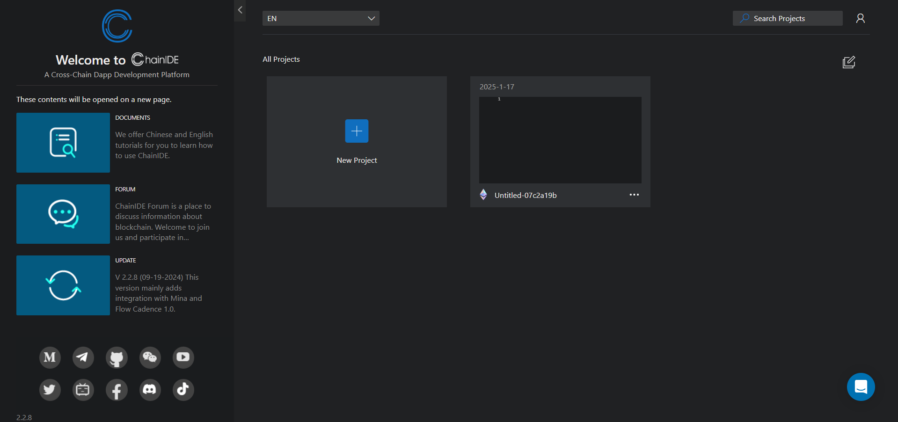
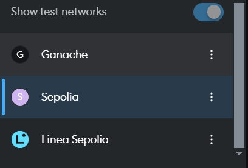
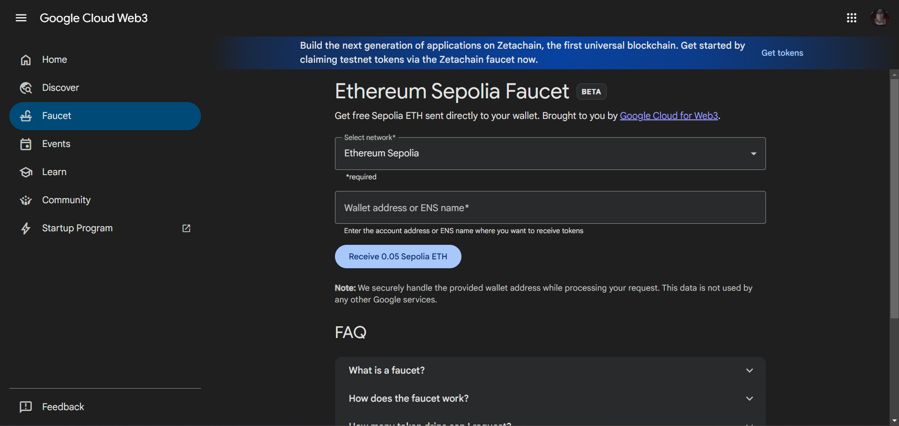
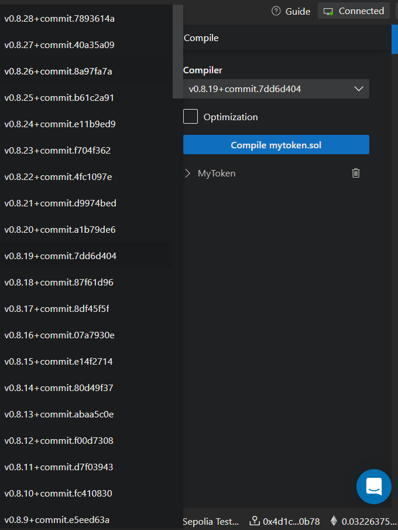
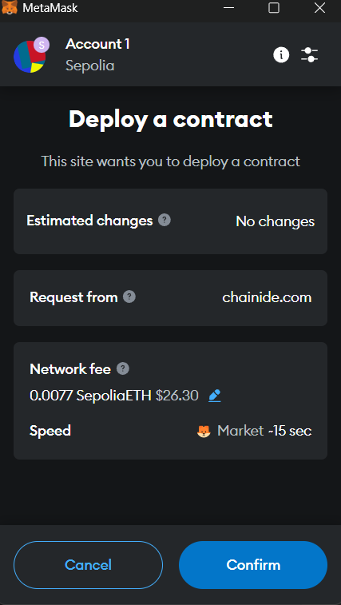
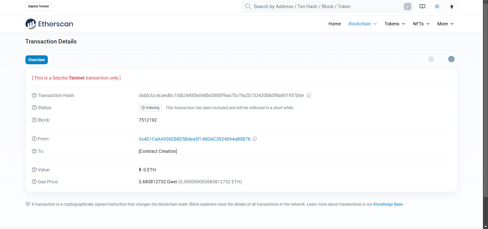
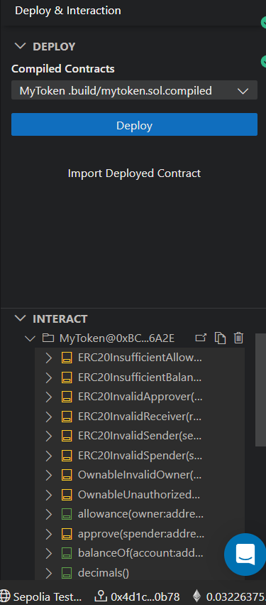

**Blockchain Technologies**

---

_Assignment 3 Part 1_


# ERC-20 Token Implementation

## Overview
This project implements an ERC-20 token using the Solidity programming language. The token is named `AITUSE-2320` and includes several features to enhance functionality and provide transaction details. The implementation adheres to the following requirements:

### Features
1. **Token Creation**:
   - Token Name: `AITUSE-2320`
   - Initial Supply: 2000 tokens
   - Standard: ERC-20

2. **Transaction Information**:
   - Functions to retrieve and display transaction details.
   - Retrieve the block timestamp of the latest transaction in a human-readable format.
   - Retrieve the address of the transaction sender.
   - Retrieve the address of the transaction receiver.

## File Structure
```
Blockchain1Assignment3-1/
├── MyToken.sol         # Solidity file implementing the ERC-20 token
├── README.md           # Documentation for the project
├── screenshots/        # Folder containing project visuals
├── .gitignore          # Git ignore file
└── .git/               # Git repository folder
```

## Implementation Details
### 1. ERC-20 Token
The token contract is implemented using the OpenZeppelin ERC-20 library for robust and secure code. The `MyToken.sol` file contains:
- Token initialization with a name, symbol, and supply.
- Functions to transfer tokens and query balances.

### 2. Additional Functions
- **Transaction Information**:
  - Function to display transaction details (sender, receiver, amount).
  - Function to return the block timestamp of the latest transaction in a human-readable format.
  - Function to retrieve sender and receiver addresses for any transaction.

## References
- [YouTube: Understanding ERC20 Tokens](https://www.youtube.com/watch?v=-5j6Ho0Bkfk)
- [YouTube: Writing a Token Contract](https://www.youtube.com/watch?v=o9Ux3xDrkIo)
- [YouTube: Create a Token on BnB Chain](https://www.youtube.com/watch?v=Q_wK6N9GtS8)
- [YouTube: Create an ERC20 Token](https://www.youtube.com/watch?v=ZLFiGHIxS1c)
- [OpenZeppelin Wizard](https://wizard.openzeppelin.com/)
- [Solidity by Example: ERC20](https://solidity-by-example.org/app/erc20/)

## Setup Instructions
1. **Install Dependencies**:
   Ensure you have the following installed:
   - Node.js
   - Hardhat
   - MetaMask

2. **Compile the Contract**:
   Use Hardhat to compile the `MyToken.sol` file:
   ```bash
   npx hardhat compile
   ```

3. **Deploy the Contract**:
   Deploy the contract to a local or test network:
   ```bash
   npx hardhat run scripts/deploy.js --network <network-name>
   ```

4. **Interact with the Contract**:
   Use Hardhat or a frontend to call the custom functions and standard ERC-20 functions.

## Screenshots
Refer to the `screenshots/` directory for visuals demonstrating the implementation.

## Notes
- Ensure the latest Solidity version is used for compatibility.
- Use a test network (e.g., Ropsten, Rinkeby) for deployment to avoid real costs.
- Verify the contract on Etherscan if deployed on a public network.


# Bonus Task

## Chain Ide

## Visit the website of the Chain Ide:

```bash
https://chainide.com/
```

## Register and create a blank project



## Create file named:

```bash
mytoken.sol
```
and after that you need to paste our file from remix

## Swithing the metamask network from ganache to Sepolia:



## Gaining Sepolia ETH by visiting this website and pasting our wallet address:

```bash
https://cloud.google.com/application/web3/faucet/ethereum/sepolia
```



## File compilation with the latest version:



## File deployment:



## Overwiew of the successfull transaction:



## Fulfilled interaction block:


